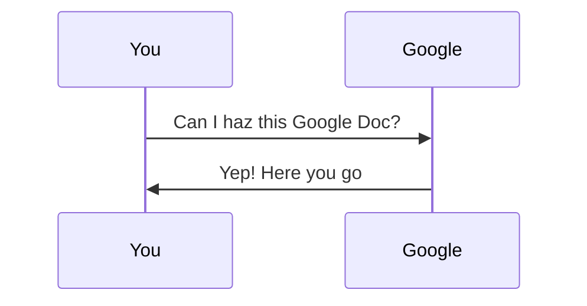
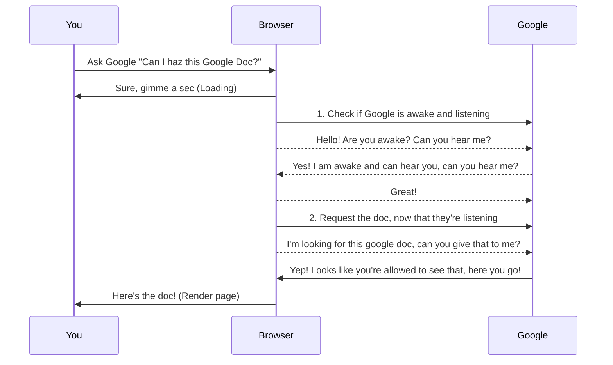
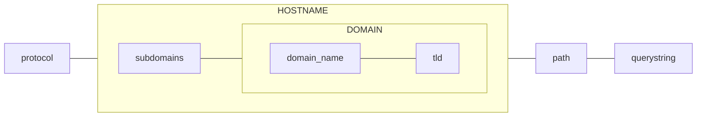
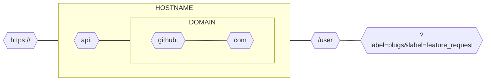

# API-solutely Fabulous

A crash course on HTTP APIs

---
layout: center
---


**Nick Cannariato** (aka. **@birdcar**)

Co-founder / Product @ Yetto


---
layout: default
---

## Places I've supported

<div class="py-24 sm:py-24">
  <div class="mx-auto max-w-7xl px-6 lg:px-8">
    <div class="-mx-6 grid grid-cols-2 gap-0.5 overflow-hidden sm:mx-0 sm:rounded-2xl md:grid-cols-3">
      <div class="bg-zinc-600/5 p-8 sm:p-10">
        
      </div>
      <div class="bg-zinc-600/5 p-6 sm:p-10">
        
      </div>
      <div class="bg-zinc-600/5 p-6 sm:p-10">
        
      </div>
      <div class="bg-zinc-600/5 p-6 sm:p-10">
        
      </div>
      <div class="bg-zinc-600/5 p-6 sm:p-10">
        
      </div>
      <div class="bg-zinc-600/5 p-6 sm:p-10">
        
      </div>
    </div>
  </div>
</div>

<style>
  h2 {
    text-align: center;
  }
</style>

---
layout: quote
---

You can never understand everything, but you should push yourself to understand the system

-- Ryan Dahl (Creator of Node.js)

---
layout: section
---

## What is an API?

---
layout: center
---

## What is an API

API stands for "Application Programming Interface"

...but wtf does any of that mean?

---
layout: center
---

How *you* think you're opening a Google Doc

<br />
<br />



---
layout: center
---

The (very simplified) reality of what's happening in the background

<br />
<br />



---
layout: full
---

## Headers

```http{all|1|5|all}
HTTP/1.1 200 OK
Access-Control-Allow-Origin: *
Connection: Keep-Alive
Content-Encoding: gzip
Content-Type: text/html; charset=utf-8
Date: Mon, 18 Jul 2016 16:06:00 GMT
Etag: "c561c68d0ba92bbeb8b0f612a9199f722e3a621a"
Keep-Alive: timeout=5, max=997
Last-Modified: Mon, 18 Jul 2016 02:36:04 GMT
Server: Apache
Set-Cookie: mykey=myvalue; expires=Mon, 17-Jul-2017 16:06:00 GMT; Max-Age=31449600; Path=/; secure
Transfer-Encoding: chunked
Vary: Cookie, Accept-Encoding
X-Backend-Server: developer2.webapp.scl3.mozilla.com
X-Cache-Info: not cacheable; meta data too large
X-kuma-revision: 1085259
x-frame-options: DENY

{...}
```

---
layout: full
---

## Anatomy of a URL

<br />
<br />
<br />
<br />



---
layout: full
---

## Anatomy of a URL

<br />
<br />
<br />
<br />


